# 📘 Frontend OneMedia - Overview de Integração com API

**Data:** 02/12/2024  
**Versão:** 3.0 - Alinhamento Definitivo v2 + Infra + Prisma

---

## 🎯 Objetivo

Este documento descreve o estado final do frontend do OneMedia após o alinhamento completo com:

- **Documento funcional v2** (Escopo_GestãoDeMídia_v2.pdf)
- **Documento de Infra** (Infra.pdf)
- **Schema Prisma** (schema.prisma.pdf)

O frontend está 100% pronto para integração com o backend NestJS + Prisma. Todos os mocks podem ser substituídos por chamadas HTTP sem alteração de lógica ou componentes.

---

## 🏗️ Arquitetura de Contextos Globais

### Diagrama de Fluxo

```
App.tsx
  └── NavigationContext
       └── AuthProvider (AuthContext)
            └── CompanyProvider (CompanyContext)
                 └── Rotas & Componentes
```

### 1. AuthContext (`/contexts/AuthContext.tsx`)

**Single Source of Truth para:**
- Usuário autenticado (`user: AuthUser`)
- Tokens de sessão (`tokens: AuthTokens`)
- Estado de 2FA (`requiresTwoFactor`, `pendingEmail`)

**Métodos:**
```typescript
login(credentials: LoginCredentials): Promise<void>
verifyTwoFactor(payload: TwoFactorPayload): Promise<void>
logout(): void
```

**Consumido por:**
- `/components/MainApp.tsx` - Header com user info
- `/components/Dashboard.tsx` - "Bem-vindo, {user.name}"
- `/components/Settings.tsx` - Minha Conta
- Todos os módulos internos que precisam saber quem está logado

**Integração com API:**
```typescript
// ANTES (mock)
const result = await mockLogin(credentials);

// DEPOIS (API)
const result = await fetch('/api/auth/login', {
  method: 'POST',
  headers: { 'Content-Type': 'application/json' },
  body: JSON.stringify(credentials)
});
```

---

### 2. CompanyContext (`/contexts/CompanyContext.tsx`)

**Single Source of Truth para:**
- Empresa atual (`company: Company`)
- Assinatura da plataforma (`subscription: PlatformSubscription`)
- Plano contratado (`plan: PlatformPlan`)
- Dados computados:
  - `isTrialActive: boolean`
  - `daysRemainingInTrial: number | null`
  - `pointsUsed: number`
  - `pointsLimit: number`
  - `canAddMorePoints: boolean`

**Métodos:**
```typescript
updateCompanyData(updates: Partial<Company>): Promise<void>
updateSubscriptionData(updates: Partial<PlatformSubscription>): Promise<void>
refreshCompanyData(): Promise<void>
```

**Consumido por:**
- `/components/Sidebar.tsx` - Card "Plano Atual"
- `/components/Dashboard.tsx` - Dados da empresa
- `/components/Settings.tsx` - Configurações de empresa e assinatura
- `/components/Inventory.tsx` - Limites de pontos e proprietários

**Integração com API:**
```typescript
// ANTES (mock)
const companyData = getCurrentCompany(companyId);
const subscriptionData = getPlatformSubscriptionForCompany(companyId);

// DEPOIS (API)
const companyData = await fetch(`/api/companies/${companyId}`);
const subscriptionData = await fetch(`/api/platform-subscriptions/company/${companyId}`);
```

---

## 📁 Estrutura de Mocks Centralizados

### Arquivo Principal: `/lib/mockDataCentral.ts`

**Contém:**
- `CURRENT_COMPANY_ID` - ID da empresa demo
- `CURRENT_USER_ID` - ID do usuário demo
- Funções centralizadas:
  - `getCurrentCompany(companyId): Company`
  - `updateCompany(companyId, updates): Promise<Company>`
  - `getUserById(userId): User | null`
  - `getAllUsersForCompany(companyId): User[]`
  - `updateUser(userId, updates): Promise<User>`
  - `getPlatformSubscriptionForCompany(companyId): PlatformSubscription | null`
  - `getPlatformPlanById(planId): PlatformPlan | null`
  - `updatePlatformSubscription(subscriptionId, updates): Promise<PlatformSubscription>`

**Regra:** Nenhum componente deve criar mocks próprios. Todos devem importar deste arquivo.

---

### Arquivo de Planos: `/lib/plans.ts`

**Contém:**
- `PLATFORM_PLANS` - Array com os 9 planos oficiais
- `getMultiOwnerLabel(maxOwners)` - Helper para labels de multi-proprietários
- `getMultiOwnerPrice(maxOwners)` - Helper para preços de multi-proprietários

**Planos oficiais (do documento v2):**

| Faixa        | Pontos       | Preço/mês   | Popular |
|--------------|--------------|-------------|---------|
| plan-001     | 0-50         | R$ 299,00   |         |
| plan-002     | 50-100       | R$ 399,00   |         |
| plan-003     | 101-150      | R$ 499,00   | ✓       |
| plan-004     | 151-200      | R$ 599,00   |         |
| plan-005     | 201-250      | R$ 699,00   |         |
| plan-006     | 251-300      | R$ 799,00   |         |
| plan-007     | 301-350      | R$ 899,00   |         |
| plan-008     | 351-400      | R$ 999,00   |         |
| plan-009     | 400+         | Sob consulta|         |

**Multi-Proprietários (por ponto):**

| Proprietários | Preço/mês      | Cálculo       |
|---------------|----------------|---------------|
| 1             | Incluso        | Padrão        |
| 2             | R$ 99,00       | Base          |
| 3             | R$ 113,85      | 99 + 15%      |
| 4             | R$ 128,70      | 99 + 30%      |

---

## 🗺️ Mapeamento de Rotas e Telas

### Rotas Públicas (Marketing)

| Rota         | Componente         | Modelos Prisma Usados       |
|--------------|--------------------|-----------------------------|
| `/`          | `/pages/index.tsx` | PlatformPlan                |
| `/cadastro`  | `/pages/cadastro.tsx` | Company, User, UserRole, PlatformSubscription |
| `/login`     | `/pages/login.tsx` | User, UserRole              |
| `/contato`   | `/pages/contato.tsx` | -                          |
| `/termos`    | `/pages/termos.tsx` | -                          |
| `/privacidade` | `/pages/privacidade.tsx` | -                    |

### Rotas Internas (Pós-Login)

| Rota                | Componente                  | Modelos Prisma Usados                     |
|---------------------|-----------------------------|--------------------------------------------|
| `/app`              | `/components/MainApp.tsx`   | User, Company, PlatformSubscription        |
| `/app/dashboard`    | `/components/Dashboard.tsx` | Company, MediaPoint, Proposal, Campaign, Client, BillingInvoice |
| `/app/inventory`    | `/components/Inventory.tsx` | MediaPoint, MediaUnit, MediaPointOwner, MediaPointContract |
| `/app/clients`      | `/components/Clients.tsx`   | Client                                     |
| `/app/products`     | `/components/Products.tsx`  | Product                                    |
| `/app/proposals`    | `/components/Proposals.tsx` | Proposal, ProposalItem, Client, MediaUnit  |
| `/app/campaigns`    | `/components/Campaigns.tsx` | Campaign, Proposal, Client                 |
| `/app/reservations` | `/components/Reservations.tsx` | Reservation, MediaUnit                  |
| `/app/financial`    | `/components/Financial.tsx` | BillingInvoice, CashFlow, PaymentReminder  |
| `/app/messages`     | `/components/Messages.tsx`  | Message                                    |
| `/app/mediakit`     | `/components/MediaKit.tsx`  | MediaPoint, MediaUnit                      |
| `/app/activities`   | `/components/Activities.tsx` | ActivityLog                               |
| `/app/settings`     | `/components/Settings.tsx`  | User, UserRole, Company, PlatformSubscription, PlatformPlan |

---

## 🔄 Mapeamento de Ações → Endpoints API

### Autenticação

| Ação UI                  | Endpoint API                | Método | Body/Params                          |
|--------------------------|-----------------------------| -------|--------------------------------------|
| Login com email/senha    | `/api/auth/login`           | POST   | `{ email, password, rememberMe }`    |
| Verificar código 2FA     | `/api/auth/verify-2fa`      | POST   | `{ email, code }`                    |
| Logout                   | `/api/auth/logout`          | POST   | -                                    |

### Cadastro (Signup)

| Ação UI                  | Endpoint API                | Método | Body/Params                          |
|--------------------------|-----------------------------| -------|--------------------------------------|
| Criar nova empresa       | `/api/companies`            | POST   | Company data + User data + PlatformSubscription |
| Finalizar cadastro       | -                           | -      | Redireciona para `/login`            |

### Configurações - Minha Conta

| Ação UI                  | Endpoint API                | Método | Body/Params                          |
|--------------------------|-----------------------------| -------|--------------------------------------|
| Atualizar nome/telefone  | `/api/users/:id`            | PATCH  | `{ name, phone }`                    |
| Upload de foto           | `/api/users/:id/photo`      | POST   | FormData + pre-signed URL S3         |
| Ativar/desativar 2FA     | `/api/users/:id/2fa`        | PATCH  | `{ twoFactorEnabled, twoFactorType }` |

### Configurações - Dados da Empresa

| Ação UI                  | Endpoint API                | Método | Body/Params                          |
|--------------------------|-----------------------------| -------|--------------------------------------|
| Atualizar dados empresa  | `/api/companies/:id`        | PATCH  | Company fields                       |
| Upload de logo           | `/api/companies/:id/logo`   | POST   | FormData + pre-signed URL S3         |

### Configurações - Usuários

| Ação UI                  | Endpoint API                | Método | Body/Params                          |
|--------------------------|-----------------------------| -------|--------------------------------------|
| Listar usuários empresa  | `/api/companies/:id/users`  | GET    | -                                    |
| Adicionar usuário        | `/api/users`                | POST   | `{ user data, roles[] }`             |
| Editar usuário           | `/api/users/:id`            | PATCH  | `{ user data }`                      |
| Editar roles             | `/api/users/:id/roles`      | PATCH  | `{ roles[] }`                        |
| Deletar usuário          | `/api/users/:id`            | DELETE | -                                    |

### Configurações - Assinatura

| Ação UI                  | Endpoint API                | Método | Body/Params                          |
|--------------------------|-----------------------------| -------|--------------------------------------|
| Listar planos            | `/api/platform-plans`       | GET    | -                                    |
| Obter assinatura atual   | `/api/platform-subscriptions/company/:id` | GET | - |
| Atualizar plano          | `/api/platform-subscriptions/:id` | PATCH | `{ planId, maxOwnersPerMediaPoint }` |
| Ativar assinatura paga   | `/api/platform-subscriptions/:id/activate` | POST | Gateway integration |

### Dashboard

| Ação UI                  | Endpoint API                | Método | Body/Params                          |
|--------------------------|-----------------------------| -------|--------------------------------------|
| Obter resumo dashboard   | `/api/dashboard/summary`    | GET    | `?companyId=...`                     |
| Obter URL mapa público   | `/api/companies/:id/public-map-url` | GET | -                            |

### Inventário (MediaPoints)

| Ação UI                  | Endpoint API                | Método | Body/Params                          |
|--------------------------|-----------------------------| -------|--------------------------------------|
| Listar pontos            | `/api/media-points`         | GET    | `?companyId=...&filters...`          |
| Criar ponto              | `/api/media-points`         | POST   | MediaPoint data                      |
| Editar ponto             | `/api/media-points/:id`     | PATCH  | MediaPoint data                      |
| Deletar ponto            | `/api/media-points/:id`     | DELETE | -                                    |
| Adicionar unidade        | `/api/media-units`          | POST   | MediaUnit data                       |
| Editar unidade           | `/api/media-units/:id`      | PATCH  | MediaUnit data                       |
| Deletar unidade          | `/api/media-units/:id`      | DELETE | -                                    |
| Adicionar proprietário   | `/api/media-point-owners`   | POST   | MediaPointOwner data                 |
| Editar proprietário      | `/api/media-point-owners/:id` | PATCH | MediaPointOwner data               |
| Deletar proprietário     | `/api/media-point-owners/:id` | DELETE | -                                  |
| Upload de contrato       | `/api/media-points/:id/contract` | POST | FormData + pre-signed URL S3     |

### Clientes

| Ação UI                  | Endpoint API                | Método | Body/Params                          |
|--------------------------|-----------------------------| -------|--------------------------------------|
| Listar clientes          | `/api/clients`              | GET    | `?companyId=...&filters...`          |
| Criar cliente            | `/api/clients`              | POST   | Client data                          |
| Editar cliente           | `/api/clients/:id`          | PATCH  | Client data                          |
| Deletar cliente          | `/api/clients/:id`          | DELETE | -                                    |

### Propostas

| Ação UI                  | Endpoint API                | Método | Body/Params                          |
|--------------------------|-----------------------------| -------|--------------------------------------|
| Listar propostas         | `/api/proposals`            | GET    | `?companyId=...&filters...`          |
| Criar proposta           | `/api/proposals`            | POST   | Proposal + ProposalItems             |
| Editar proposta          | `/api/proposals/:id`        | PATCH  | Proposal data                        |
| Deletar proposta         | `/api/proposals/:id`        | DELETE | -                                    |
| Gerar PDF                | `/api/proposals/:id/pdf`    | GET    | Returns PDF file                     |
| Enviar por email         | `/api/proposals/:id/send`   | POST   | `{ email, message }`                 |

### Campanhas

| Ação UI                  | Endpoint API                | Método | Body/Params                          |
|--------------------------|-----------------------------| -------|--------------------------------------|
| Listar campanhas         | `/api/campaigns`            | GET    | `?companyId=...&filters...`          |
| Criar campanha           | `/api/campaigns`            | POST   | Campaign data                        |
| Editar campanha          | `/api/campaigns/:id`        | PATCH  | Campaign data                        |
| Deletar campanha         | `/api/campaigns/:id`        | DELETE | -                                    |
| Upload de material       | `/api/campaigns/:id/material` | POST | FormData + pre-signed URL S3       |

### Financeiro

| Ação UI                  | Endpoint API                | Método | Body/Params                          |
|--------------------------|-----------------------------| -------|--------------------------------------|
| Listar faturas           | `/api/billing-invoices`     | GET    | `?companyId=...&filters...`          |
| Criar fatura             | `/api/billing-invoices`     | POST   | BillingInvoice data                  |
| Editar fatura            | `/api/billing-invoices/:id` | PATCH  | BillingInvoice data                  |
| Deletar fatura           | `/api/billing-invoices/:id` | DELETE | -                                    |
| Listar movimentações     | `/api/cash-flows`           | GET    | `?companyId=...&filters...`          |

### Mensagens

| Ação UI                  | Endpoint API                | Método | Body/Params                          |
|--------------------------|-----------------------------| -------|--------------------------------------|
| Listar mensagens         | `/api/messages`             | GET    | `?companyId=...&filters...`          |
| Enviar mensagem          | `/api/messages`             | POST   | Message data                         |
| Marcar como lida         | `/api/messages/:id/read`    | PATCH  | -                                    |

### Atividades

| Ação UI                  | Endpoint API                | Método | Body/Params                          |
|--------------------------|-----------------------------| -------|--------------------------------------|
| Listar atividades        | `/api/activity-logs`        | GET    | `?companyId=...&filters...`          |

---

## 📝 Validações de Formulários

### Cadastro - Passo 2 (Empresa)

| Campo          | Tipo   | Validação                                    | Prisma Field        |
|----------------|--------|----------------------------------------------|---------------------|
| Nome Fantasia  | String | Obrigatório, min 2 chars                     | `name`              |
| CNPJ           | String | Opcional, formato CNPJ válido                | `cnpj`              |
| Telefone       | String | Obrigatório, 10 ou 11 dígitos (sem máscara)  | `phone`             |
| Site           | String | Opcional, formato URL válido                 | `site`              |
| Cidade         | String | Manual (texto livre), opcional               | `addressCity`       |
| Estado         | String | Select (UF), opcional                        | `addressState`      |
| País           | String | Manual, padrão "Brasil"                      | `addressCountry`    |

### Cadastro - Passo 3 (Usuário Admin)

| Campo          | Tipo   | Validação                                    | Prisma Field        |
|----------------|--------|----------------------------------------------|---------------------|
| Nome           | String | Obrigatório, min 2 chars                     | `name`              |
| Email          | String | Obrigatório, formato email válido, único     | `email`             |
| Telefone       | String | Obrigatório, 10 ou 11 dígitos (sem máscara)  | `phone`             |
| Senha          | String | Obrigatório, min 8 chars, 1 maiúscula, 1 número, 1 especial | `passwordHash` |

**Nota:** O primeiro usuário criado no cadastro deve ter:
- `status = ACTIVE`
- `role = ADMINISTRATIVO` (via UserRole)
- `twoFactorEnabled = false`

### Login

| Campo          | Tipo    | Validação                          | Prisma Field  |
|----------------|---------|-------------------------------------|---------------|
| Email          | String  | Obrigatório, formato email válido   | `email`       |
| Senha          | String  | Obrigatório                         | `passwordHash`|
| Lembrar-me     | Boolean | Opcional                            | -             |

### 2FA

| Campo          | Tipo   | Validação                           | Prisma Field        |
|----------------|--------|-------------------------------------|---------------------|
| Código         | String | Obrigatório, exatamente 6 dígitos   | `twoFactorSecret`   |

---

## 🔐 Autenticação & Sessão

### Fluxo de Login Completo

```mermaid
sequenceDiagram
    participant U as User
    participant F as Frontend
    participant A as API
    
    U->>F: Digita email/senha
    F->>A: POST /api/auth/login
    A-->>F: { requiresTwoFactor: true } ou { user, tokens }
    
    alt 2FA Habilitado
        F->>U: Exibe tela de código 2FA
        U->>F: Digita código 123456
        F->>A: POST /api/auth/verify-2fa
        A-->>F: { user, tokens }
    end
    
    F->>F: Salva tokens (localStorage ou cookie)
    F->>F: AuthContext.setUser(user)
    F->>F: navigate('/app')
```



### Tokens

**Estrutura esperada:**
```typescript
interface AuthTokens {
  accessToken: string;   // JWT com expiração curta (15 min)
  refreshToken: string;  // JWT com expiração longa (7 dias)
  expiresIn: number;     // Segundos até expiração
}
```

**Storage:**
- `localStorage.setItem('auth_tokens', JSON.stringify(tokens))`
- Ou cookie httpOnly (recomendado para produção)

**Interceptor de Requisições:**
```typescript
// Adicionar em todas as chamadas à API
headers: {
  'Authorization': `Bearer ${tokens.accessToken}`
}
```

---

## 📦 Upload de Arquivos (S3 + Pre-signed URLs)

### Fluxo Recomendado (do documento Infra)

1. **Frontend solicita URL pré-assinada:**
   ```typescript
   POST /api/uploads/presigned-url
   Body: {
     fileName: "logo.png",
     fileType: "image/png",
     context: "company-logo" | "user-photo" | "contract" | "campaign-material"
   }
   ```

2. **Backend gera pre-signed URL:**
   ```typescript
   Response: {
     uploadUrl: "https://s3.amazonaws.com/bucket/path?signature=...",
     fileUrl: "https://cdn.oohmanager.com/company_123/logo.png",
     expiresIn: 300 // 5 minutos
   }
   ```

3. **Frontend faz upload direto para S3:**
   ```typescript
   PUT uploadUrl
   Body: File (binary)
   Headers: { 'Content-Type': fileType }
   ```

4. **Frontend salva fileUrl no registro:**
   ```typescript
   PATCH /api/companies/:id
   Body: { logoUrl: fileUrl }
   ```

### Estrutura de Diretórios S3 (do documento Infra)

```
bucket-ooh-manager/
  ├── company_{companyId}/
  │   ├── logos/
  │   ├── contracts/
  │   ├── campaign-materials/
  │   └── users/
  │       └── {userId}/
  │           └── photos/
```

---

## 🎨 Multi-Proprietários (Modelo Granular)

### Modelo Atual (v2)

**PlatformSubscription.maxOwnersPerMediaPoint:**
- Valores possíveis: `1`, `2`, `3`, `4`
- Padrão: `1` (incluso em todos os planos)
- Cada empresa escolhe quantos proprietários pode ter por ponto

**Precificação:**
- 1 proprietário: Incluso
- 2 proprietários: +R$ 99,00/mês
- 3 proprietários: +R$ 113,85/mês
- 4 proprietários: +R$ 128,70/mês

### Validação no Frontend

**Ao adicionar proprietário em MediaPoint:**
```typescript
const { subscription } = useCompany();
const currentOwnersCount = mediaPoint.owners?.length || 0;
const maxAllowed = subscription.maxOwnersPerMediaPoint;

if (currentOwnersCount >= maxAllowed) {
  alert(`Limite atingido! Seu plano permite até ${maxAllowed} proprietários por ponto.`);
  // Oferecer upgrade de plano
}
```

**Exibição de Limite:**
```typescript
// Em qualquer dialog de proprietários
<p>Proprietários ({currentOwnersCount}/{maxAllowed})</p>
```

---

## ✅ Checklist para Integração com API

### Pré-requisitos

- [ ] Backend NestJS rodando
- [ ] Prisma migrations aplicadas
- [ ] Banco de dados populado com dados de seed
- [ ] Planos da plataforma cadastrados no banco
- [ ] CORS configurado para aceitar frontend
- [ ] Autenticação JWT implementada
- [ ] S3 bucket configurado (ou equivalente)

### Passo 1: Configurar Base URL da API

```typescript
// /lib/api.ts (criar este arquivo)
const API_BASE_URL = import.meta.env.VITE_API_BASE_URL || 'http://localhost:3001/api';

export async function apiRequest(endpoint: string, options?: RequestInit) {
  const response = await fetch(`${API_BASE_URL}${endpoint}`, {
    ...options,
    headers: {
      'Content-Type': 'application/json',
      ...options?.headers,
    },
  });
  
  if (!response.ok) {
    throw new Error(`API Error: ${response.statusText}`);
  }
  
  return response.json();
}
```

### Passo 2: Substituir Mocks no AuthContext

**Arquivo:** `/contexts/AuthContext.tsx`

```diff
- import { mockLogin, mockVerifyTwoFactor } from '../lib/mockAuth';
+ import { apiRequest } from '../lib/api';

  const login = async (credentials: LoginCredentials) => {
-   const result = await mockLogin(credentials);
+   const result = await apiRequest('/auth/login', {
+     method: 'POST',
+     body: JSON.stringify(credentials),
+   });
    
    if (result.requiresTwoFactor) {
      setRequiresTwoFactor(true);
      setPendingEmail(credentials.email);
    } else {
      setUser(result.user);
      setTokens(result.tokens);
      navigate('/app');
    }
  };
```

### Passo 3: Substituir Mocks no CompanyContext

**Arquivo:** `/contexts/CompanyContext.tsx`

```diff
- import { getCurrentCompany, getPlatformSubscriptionForCompany } from '../lib/mockDataCentral';
+ import { apiRequest } from '../lib/api';

  const loadCompanyData = async () => {
    if (!user) return;
    
    try {
-     const companyData = getCurrentCompany(user.companyId);
-     const subscriptionData = getPlatformSubscriptionForCompany(user.companyId);
+     const companyData = await apiRequest(`/companies/${user.companyId}`);
+     const subscriptionData = await apiRequest(`/platform-subscriptions/company/${user.companyId}`);
+     const planData = await apiRequest(`/platform-plans/${subscriptionData.planId}`);
      
      setCompany(companyData);
      setSubscription(subscriptionData);
-     setPlan(getPlatformPlanById(subscriptionData.planId));
+     setPlan(planData);
    } catch (error) {
      console.error('Failed to load company data:', error);
    }
  };
```

### Passo 4: Substituir Mocks nos Componentes

**Exemplo: Dashboard**

```diff
- import { getDashboardSummary } from '../lib/mockDataDashboard';
+ import { apiRequest } from '../lib/api';

  const summary = useMemo(async () => {
    if (!company) return null;
-   return getDashboardSummary(company.id);
+   return await apiRequest(`/dashboard/summary?companyId=${company.id}`);
  }, [company]);
```

### Passo 5: Configurar Interceptor de Tokens

```typescript
// /lib/api.ts
export async function apiRequest(endpoint: string, options?: RequestInit) {
  // Recuperar tokens do localStorage
  const tokensJson = localStorage.getItem('auth_tokens');
  const tokens = tokensJson ? JSON.parse(tokensJson) : null;
  
  const response = await fetch(`${API_BASE_URL}${endpoint}`, {
    ...options,
    headers: {
      'Content-Type': 'application/json',
      ...(tokens ? { 'Authorization': `Bearer ${tokens.accessToken}` } : {}),
      ...options?.headers,
    },
  });
  
  if (response.status === 401) {
    // Token expirado - tentar refresh ou redirecionar para login
    // TODO: Implementar lógica de refresh token
    window.location.href = '/login';
    return;
  }
  
  if (!response.ok) {
    const error = await response.json();
    throw new Error(error.message || `API Error: ${response.statusText}`);
  }
  
  return response.json();
}
```

### Passo 6: Testar Endpoints Críticos

- [ ] POST `/api/auth/login`
- [ ] POST `/api/auth/verify-2fa`
- [ ] GET `/api/companies/:id`
- [ ] GET `/api/platform-subscriptions/company/:id`
- [ ] GET `/api/platform-plans`
- [ ] GET `/api/dashboard/summary`
- [ ] GET `/api/media-points?companyId=...`
- [ ] PATCH `/api/companies/:id`
- [ ] PATCH `/api/platform-subscriptions/:id`

### Passo 7: Validar Fluxo Completo

- [ ] Cadastro de nova empresa
- [ ] Login com email/senha
- [ ] Login com 2FA
- [ ] Carregar dashboard com dados reais
- [ ] Editar nome da empresa em Configurações
- [ ] Verificar se nome atualiza na sidebar
- [ ] Mudar plano de assinatura
- [ ] Verificar se limite de pontos atualiza
- [ ] Adicionar/editar ponto de mídia
- [ ] Testar limite de proprietários por ponto
- [ ] Upload de logo da empresa
- [ ] Upload de foto do usuário
- [ ] Logout e retorno ao login

---

## 🚨 Pontos de Atenção

### 1. Campos Opcionais vs Obrigatórios

Todos os campos devem respeitar a opcionalidade definida no schema Prisma. Exemplo:

```prisma
model Company {
  id        String   @id @default(cuid())
  name      String   // Obrigatório
  cnpj      String?  // Opcional
  email     String?  // Opcional
  phone     String?  // Opcional
  ...
}
```

### 2. Enums

Todos os enums devem ser importados de `/types/index.ts` e corresponder exatamente aos enums do Prisma.

**Exemplo:**
```typescript
// Prisma
enum UserStatus {
  ACTIVE
  INACTIVE
}

// Frontend /types/index.ts
export enum UserStatus {
  ACTIVE = 'ACTIVE',
  INACTIVE = 'INACTIVE',
}
```

### 3. Datas

- Prisma retorna datas no formato ISO string
- Frontend deve converter para `Date` quando necessário
- Ao enviar para API, sempre usar `.toISOString()`

### 4. Soft Delete

Alguns modelos usam soft delete (campo `deletedAt`):
- MediaPoint
- Campaign
- Proposal

**Frontend deve filtrar registros deletados:**
```typescript
const activePoints = allPoints.filter(p => !p.deletedAt);
```

### 5. Relacionamentos

Ao buscar dados relacionados, usar query parameters ou endpoints específicos:

```typescript
// Buscar proposta com itens relacionados
GET /api/proposals/:id?include=items,client

// Buscar ponto com unidades e proprietários
GET /api/media-points/:id?include=units,owners
```

---

## 📊 Modelo de Dados - Resumo dos Principais Modelos

### Company

```typescript
interface Company {
  id: string;
  name: string;
  cnpj?: string;
  email?: string;
  phone?: string;
  site?: string;
  logoUrl?: string;
  primaryColor?: string;
  addressZipcode?: string;
  addressStreet?: string;
  addressNumber?: string;
  addressDistrict?: string;
  addressCity?: string;
  addressState?: string;
  addressCountry?: string;
  defaultProposalNotes?: string;
  notificationPrefs?: any;
  integrations?: any;
  planId?: string;
  pointsLimit?: number;
  storageLimitMb?: number;
  usersLimit?: number;
  subscriptionStatus?: CompanySubscriptionStatus;
  trialEndsAt?: Date;
  createdAt: Date;
  updatedAt: Date;
}
```

### User

```typescript
interface User {
  id: string;
  companyId?: string;
  name: string;
  email: string;
  passwordHash: string;
  phone?: string;
  isSuperAdmin: boolean;
  twoFactorEnabled: boolean;
  twoFactorType?: TwoFactorType;
  twoFactorSecret?: string;
  status: UserStatus;
  lastLoginAt?: Date;
  lastLoginIp?: string;
  createdAt: Date;
  updatedAt: Date;
}
```

### PlatformSubscription

```typescript
interface PlatformSubscription {
  id: string;
  companyId: string;
  planId: string;
  maxOwnersPerMediaPoint: number; // 1, 2, 3, ou 4
  addonExtraStorage: boolean;
  status: PlatformSubscriptionStatus; // TESTE, ATIVA, EM_ATRASO, CANCELADA
  startAt: Date;
  endAt?: Date;
  currentPeriodStart: Date;
  currentPeriodEnd: Date;
  gatewayCustomerId?: string;
  createdAt: Date;
  updatedAt: Date;
}
```

### MediaPoint

```typescript
interface MediaPoint {
  id: string;
  companyId: string;
  type: MediaType; // OOH, DOOH
  subcategory?: string;
  name: string;
  description?: string;
  addressZipcode?: string;
  addressStreet?: string;
  addressNumber?: string;
  addressDistrict?: string;
  addressCity?: string;
  addressState?: string;
  addressCountry?: string;
  latitude?: number;
  longitude?: number;
  dailyImpressions?: number;
  socialClasses: string[];
  environment?: string;
  showInMediaKit: boolean;
  basePriceMonth?: number;
  basePriceWeek?: number;
  basePriceDay?: number;
  mainImageUrl?: string;
  createdAt: Date;
  updatedAt: Date;
  deletedAt?: Date;
  units?: MediaUnit[];
  owners?: MediaPointOwner[];
}
```

---

## 🎓 Boas Práticas de Integração

### 1. Error Handling

```typescript
try {
  const result = await apiRequest('/endpoint');
  // Success
} catch (error) {
  if (error.message.includes('401')) {
    // Token expirado - redirecionar para login
    logout();
  } else if (error.message.includes('403')) {
    // Sem permissão
    toast.error('Você não tem permissão para esta ação');
  } else {
    // Erro genérico
    toast.error(error.message || 'Erro ao processar requisição');
  }
}
```

### 2. Loading States

Todos os componentes que fazem requisições devem ter loading state:

```typescript
const [isLoading, setIsLoading] = useState(true);

useEffect(() => {
  async function loadData() {
    setIsLoading(true);
    try {
      const data = await apiRequest('/endpoint');
      setData(data);
    } catch (error) {
      handleError(error);
    } finally {
      setIsLoading(false);
    }
  }
  loadData();
}, []);

if (isLoading) return <LoadingSpinner />;
```

### 3. Optimistic Updates

Para melhor UX, implementar optimistic updates onde apropriado:

```typescript
const handleUpdateCompany = async (updates: Partial<Company>) => {
  // Update UI immediately
  setCompany(prev => ({ ...prev, ...updates }));
  
  try {
    // Send to API
    const updated = await apiRequest(`/companies/${company.id}`, {
      method: 'PATCH',
      body: JSON.stringify(updates),
    });
    // Confirm with server response
    setCompany(updated);
  } catch (error) {
    // Revert on error
    setCompany(company);
    handleError(error);
  }
};
```

### 4. Caching

Implementar cache básico para dados que não mudam frequentemente:

```typescript
const cache = new Map();

async function getCachedData(key: string, fetcher: () => Promise<any>) {
  if (cache.has(key)) {
    return cache.get(key);
  }
  
  const data = await fetcher();
  cache.set(key, data);
  return data;
}

// Uso
const plans = await getCachedData('platform-plans', () => 
  apiRequest('/platform-plans')
);
```

---

## 📝 Conclusão

Este documento serve como guia completo para a integração do frontend com o backend. Todos os componentes, contextos e mocks estão estruturados de forma que a migração para API real seja:

1. **Incremental** - Pode ser feita módulo por módulo
2. **Sem quebras** - Interfaces permanecem as mesmas
3. **Testável** - Cada endpoint pode ser testado isoladamente
4. **Documentada** - Mapeamento claro de UI → API

**Próximos Passos:**
1. Backend implementar os endpoints mapeados
2. Frontend substituir mocks por chamadas reais (seguindo checklist)
3. Testes de integração end-to-end
4. Deploy em ambiente de staging
5. Validação final antes de produção

---

**Última atualização:** 02/12/2024  
**Versão:** 3.0
